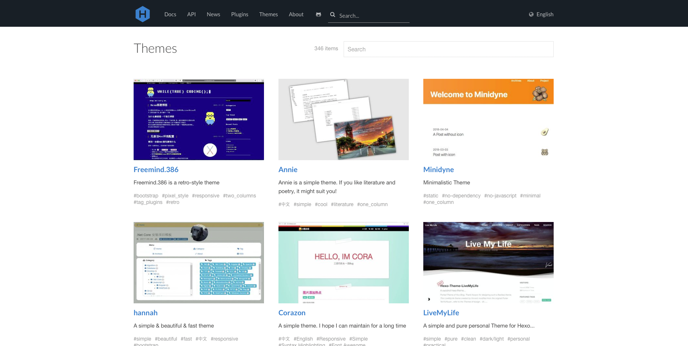
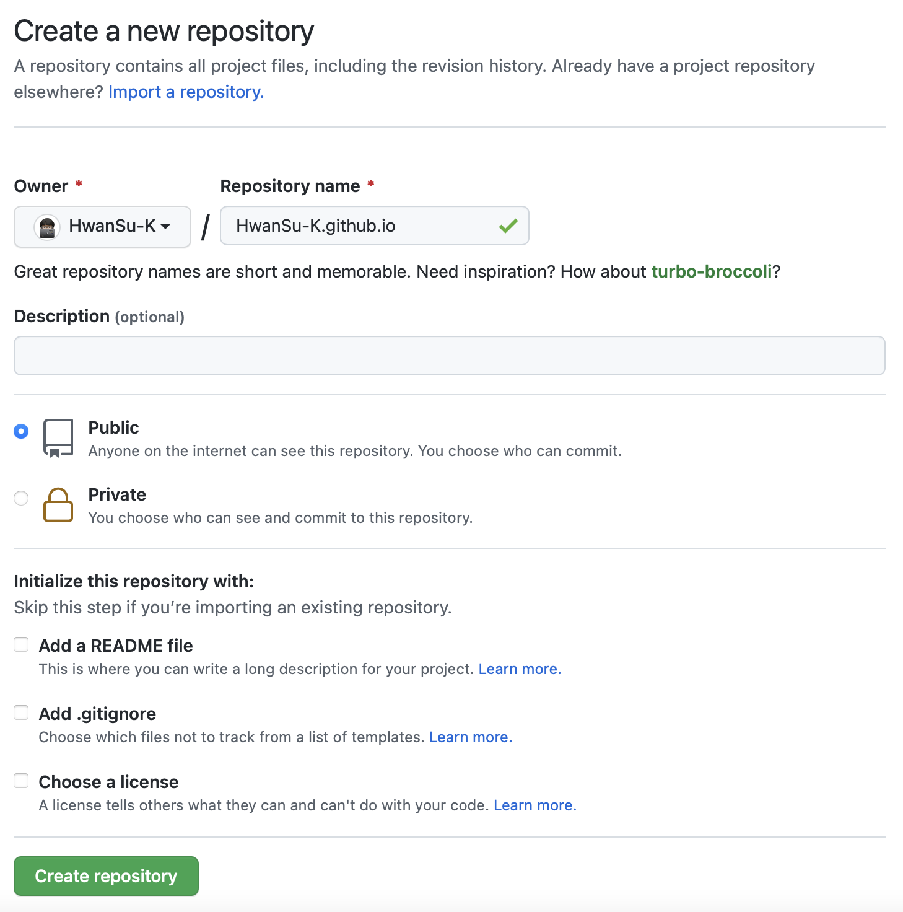

## 깃허브 블로그 만들기

개발 공부한 내용들을 정리할 기술 블로그가 필요하게 되었습니다. 편하고 많이들 사용하는 tstory, velog, brunch, notion 등 있지만, Hexo 이용하여 직접 개발 블로그를 작성한 데는 몇 가지 이유가 있습니다.

### 장점

- 커스터마이징의 자유
  - [hexo.io](http://hexo.io/) 사이트에서 테마를 골라 빠르게 시작할 수도 있고 직접 만들 수도 있다.
- 게시글 소유권
  - 다른 블로그로 이전을 하고 싶어도 이전 게시글들을 이전하기 힘들다.

### 단점

- 손이 많이 간다
  - A to Z... 처음부터 끝까지 직접 다 만들어야 한다
- 어느 정도의 지식 필요
  - 아무래도 웹으로 개발하고 배포하는 부분에서 개발지식이 필요하다.

## 무엇으로 만들지?

### Jekyll

- 특징
  - Ruby 기반
  - GitHub Page는 Jekyll에 최적화되어 있음

### Hexo

- 특징
  - Javascript 기반
  - 컴파일 속도가 빠름

### Hugo

- 특징
  - Golang 기반
  - 컴파일 속도가 빠름

## 설치 방법

기본적으로 node가 설치되어있다는 가정하에 시작하겠습니다.

```bash
npm i -g hexo-cli
hexo init
hexo s
INFO  Validating config
INFO  Start processing
INFO  Hexo is running at <http://localhost:4000> . Press Ctrl+C to stop.
```

localhost:4000으로 접속하면 기본 Hexo 페이지가 만들어졌습니다. 테마를 적용하도록 해보겠습니다.

[Hexo themes](https://hexo.io/themes/)



저는 Quiet 테마로 진행해 보겠습니다. 저장소에서 테마를 다운로드 합니다.

```bash
git clone <https://github.com/QiaoBug/hexo-theme-quiet.git> ./themes/Quiet
```

```bash
# config.yml

# Extensions
## Plugins: <https://hexo.io/plugins/>
## Themes: <https://hexo.io/themes/>
## theme: landscape
theme: Quiet
```

\_config.yml에서 기존 theme는 주석 처리하고 새로운 테마명으로 변경합니다.

서버를 종료한 뒤 새로 실행하면 테마가 적용됩니다.

### 리포지토리 만들기

{깃허브ID}.github.io로 리포지토리를 생성한 뒤 푸시합니다.



### 깃허브 페이지 배포

깃허브 페이지로 배포를 위하여 새로운 패키지를 다운로드 합니다.

```bash
npm i hexo-deployer-git
```

```bash
# config.yml

deploy:
  type: git
  repo: { 리포지토리 주소 }
  branch: gh-pages
```

\_config.yml에서 deploy 옵션을 설정합니다.

배포 명령어를 실행합니다.

```bash
hexo d -g
```

### 깃허브 페이지 설정

리포지토리 -> Setting -> GitHub Pages로 이동합니다.

Source를 gh-pages로 변경한 뒤 {깃허브ID}.github.io로 접속하면 성공적으로 배포된 것을 확인할 수 있습니다.

## 참고

- [Hexo Docs](https://hexo.io/ko/docs)
